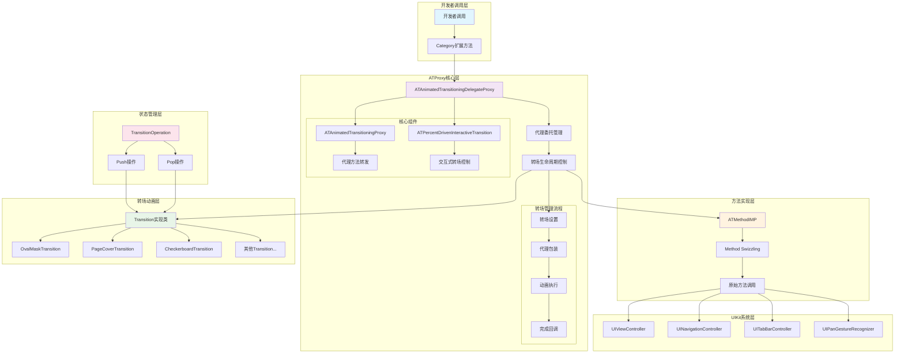

# ATProxy

[](https://travis-ci.org/YLCHUN/ATProxy)
[](https://cocoapods.org/pods/ATProxy)
[](https://cocoapods.org/pods/ATProxy)
[](https://cocoapods.org/pods/ATProxy)

## 概述

ATProxy 是一个基于代理模式的 iOS 转场动画库，为 UIKit 框架中的视图控制器转场提供了简洁易用的 API。它通过 Category 扩展和代理模式，让开发者能够轻松实现自定义转场动画，而无需修改现有的转场逻辑。

## 核心原理架构



## 核心功能

### 1. 视图控制器转场
- **Present/Dismiss 转场**: 支持模态展示和关闭时的自定义动画
- **Navigation 转场**: 支持 push/pop 操作的自定义动画
- **TabBar 转场**: 支持标签页切换时的自定义动画

### 2. 手势驱动转场
- **方向识别**: 支持上、下、左、右四个方向的手势识别
- **交互式转场**: 通过手势驱动转场动画的执行
- **自定义手势**: 可自定义手势识别器的转场回调

### 3. 丰富的转场效果
库内置了多种预定义的转场动画效果：
- **OvalMaskTransition**: 椭圆形遮罩转场
- **PageCoverTransition**: 页面覆盖转场
- **CheckerboardTransition**: 棋盘格转场
- **RadiationTransition**: 放射状转场
- **RotateTransition**: 旋转转场
- **StackTransition**: 堆叠转场
- **BusDoorTransition**: 巴士门转场
- **RRTransition**: 自定义转场

## 实现原理

### 1. 代理模式架构
ATProxy 采用代理模式，通过 `ATAnimatedTransitioningProxy` 类来管理转场动画的生命周期。当设置转场动画时，库会创建一个代理对象来包装原有的转场代理，确保不破坏现有的转场逻辑。

### 2. Method Swizzling 技术
通过 `ATMethodIMP` 模块实现方法实现的动态替换，在需要时调用原始方法实现，保证系统的兼容性和稳定性。

### 3. Category 扩展
通过 Category 为 UIKit 的核心类添加转场相关的方法，使 API 更加直观易用：
- `UIViewController+ATProxy`: 扩展视图控制器的转场能力
- `UINavigationController+ATProxy`: 扩展导航控制器的转场能力
- `UITabBarController+ATProxy`: 扩展标签控制器的转场能力
- `UIPanGestureRecognizer+ATProxy`: 扩展手势识别器的转场能力

### 4. 转场状态管理
通过 `TransitionOperation` 枚举管理转场的操作类型（Push/Pop），确保转场动画的正确执行方向。

## 使用方式

### 安装

ATProxy 可通过 [CocoaPods](https://cocoapods.org) 安装，在 Podfile 中添加：

```ruby
pod 'ATProxy'
```

### 基本用法

#### 1. 视图控制器转场

```objc
// Present 转场
PageCoverTransition *transition = [PageCoverTransition transitionWithType:PageCoverTransitionTypePush];
[self presentViewController:[SecViewController new] transitional:transition completion:nil];

// Dismiss 转场
PageCoverTransition *transition = [PageCoverTransition transitionWithType:PageCoverTransitionTypePop];
[self dismissViewControllerTtransitional:transition completion:nil];
```

#### 2. 导航控制器转场

```objc
// Push 转场
PageCoverTransition *transition = [PageCoverTransition transitionWithType:PageCoverTransitionTypePush];
[self.navigationController pushViewController:[SecViewController new] transitional:transition];

// Pop 转场
PageCoverTransition *transition = [PageCoverTransition transitionWithType:PageCoverTransitionTypePop];
[self.navigationController popViewControllerTransitional:transition];
```

#### 3. 标签控制器转场

```objc
OvalMaskTransition *transition = [[OvalMaskTransition alloc] initWithOperation:UINavigationControllerOperationPush timeInterval:2 anchor:self.view.center];
[self setSelectedIndex:1 transitional:transition];
```

#### 4. 手势驱动转场

```objc
- (UIPanGestureRecognizer *)transitionGestureRecognizer {
    UIPanGestureRecognizer *pgr = [[UIPanGestureRecognizer alloc] init];
    __weak typeof(self) wself = self;
    [pgr setInteractiveDirection:ATGestureDirectionLeft transitional:^{
        [wself transit];
    }];
    return pgr;
}
```

### 自定义转场动画

ATProxy 支持自定义转场动画，只需实现 `UIViewControllerAnimatedTransitioning` 协议：

```objc
@interface CustomTransition : NSObject <UIViewControllerAnimatedTransitioning>
@end

@implementation CustomTransition

- (NSTimeInterval)transitionDuration:(id<UIViewControllerContextTransitioning>)transitionContext {
    return 0.5;
}

- (void)animateTransition:(id<UIViewControllerContextTransitioning>)transitionContext {
    // 实现自定义动画逻辑
}

@end
```

## 示例项目

运行示例项目：
1. 克隆仓库
2. 在 Example 目录下运行 `pod install`
3. 打开 `ATProxy.xcworkspace`


## 系统要求

- iOS 8.0+
- Xcode 9.0+
- Objective-C

## 作者

YLCHUN, youlianchunios@163.com

## 许可证

ATProxy 基于 MIT 许可证开源，详见 [LICENSE](LICENSE) 文件。
